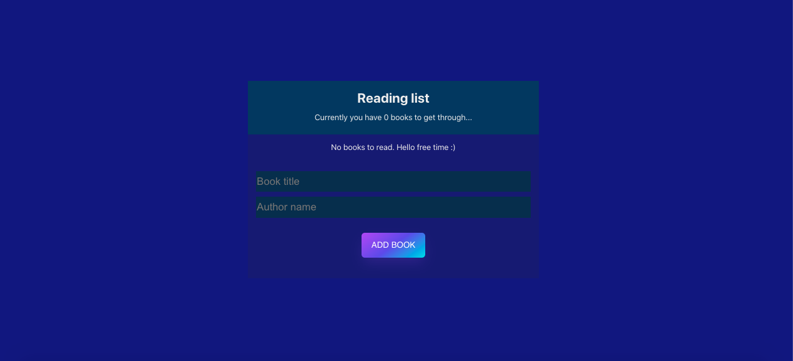
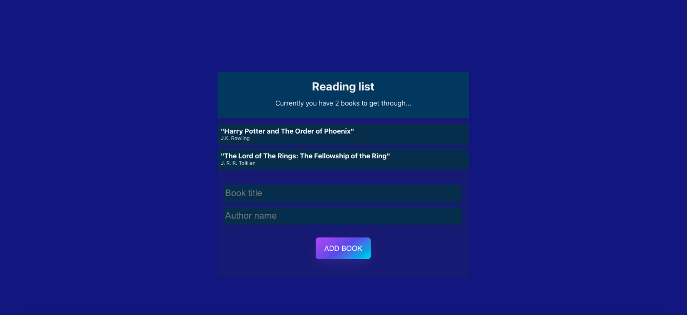
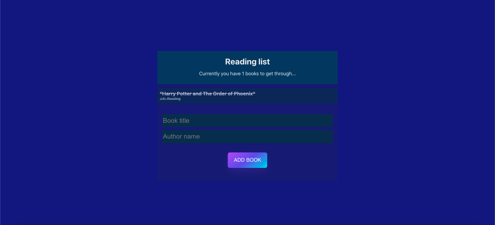
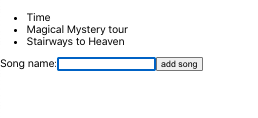
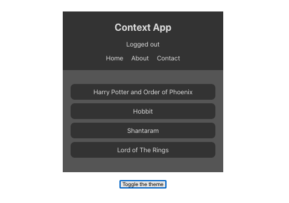
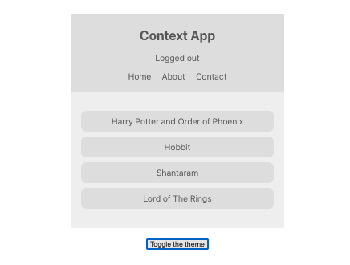

Book list app

React application of Book list created with use of Contexts, Hooks, Reducers.

## Table of Contents

* [General Info](#general-information)
* [Technologies Used](#technologies-used)
* [Screenshots](#screenshots)
* [Setup](#setup)
* [Project Status](#project-status)
* [Room for Improvement](#room-for-improvement)
* [Contact](#contact)

## General Information

- The project is divided into 3 smaller ones:

1. hooksapp - simple app that add songs to the list; made to train use of React Hooks.
2. contextapp - this app was made as a "training field" for use of React Context. It allows user to change the theme of
   the application on button.
3. booklist - main app that combines all of the techniques used in previous apps. This one specifically is made as a
   notebook in which we can add books titles and author names as well as delete ones. Then we get information how many
   books we still have to read or that we have read all of them. The data of books is saving in local storage, so it
   doesn't disappear after site refreshing. At the end I added bookReducer component to improve appearance and
   optimization of the code.

## Technologies Used

- React
- React Hooks
- React Contexts
- Reducers
- CSS
- Localstorage
- HTML
- JavaScript

## Screenshots

Book list app

Hooks app

Context app

## Setup

- Download or clone repository / `git clone repo_address`
- Install dependencies / `npm install`
- Start app by `npm start`

## Project Status

Done.

[//]: # (Assumed learning task completed.)

## Room for Improvement

- Applications are finished there will be no improvement although styling leaves a lot to be desired, but that was not
  the purpose of the exercise.

## Contact

Created by [_Duckjaniels_](https://www.linkedin.com/in/maksym-kaczorowski-008b3a154/) - feel free to contact me!